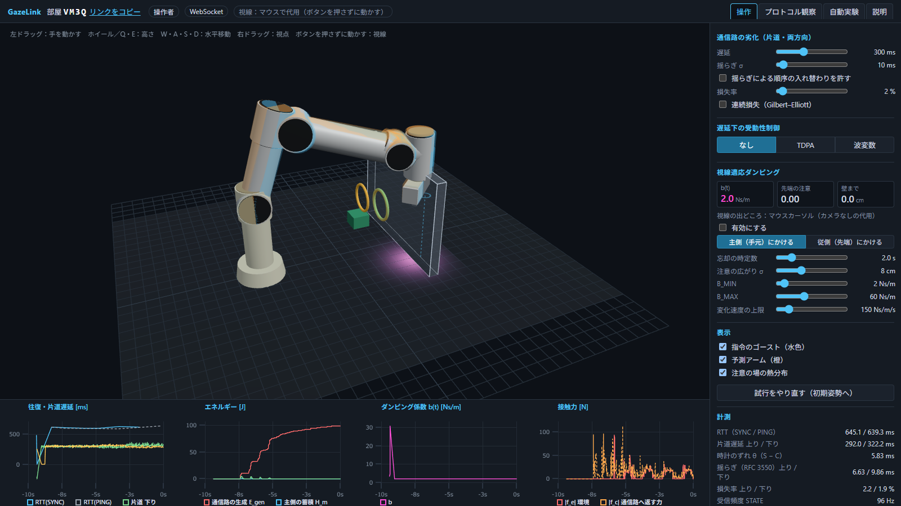

# GazeLink — 遅延ネットワーク越しの視線適応型遠隔操作シミュレータ

ブラウザ（手元）から、サーバ上で動くロボットアーム（Franka Panda 風の 7 軸）を遠隔操作するシミュレータです。

- 両者は自作のアプリケーション層プロトコル **GLP/1** でつながります。サーバの中で、人工的に遅延・揺らぎ・損失をかけられます。
- 遅延下で力を返す遠隔操作が不安定になる様子を、**受動性**（エネルギーを生み出さない性質）の観点で観測できます。
- それを受動性制御（**TDPA**・**波変数**）で抑える様子を見られます。
- **見ている場所に応じて手元の重さ（ダンピング）を変える**支援制御を、画面上で確かめられます。

授業「ネットワークコンピューティング」課題 2 の提出物です。



## 操作

**アームはキーボード、視線はマウス**で操作します。3D 画面を一度クリックすると、キー入力を受け付けるようになります（受け付けていないときは画面に「画面をクリックしてから操作」と出ます）。

| 入力 | 動作 |
|---|---|
| W・A・S・D | 手を水平に動かす（今の視点から見た前後左右） |
| Q・E | 手を上下に動かす |
| Shift（押している間） | 低速（精密操作、通常の 1/4） |
| マウスを動かす | カーソルの先を**視線**として扱う（カメラの代用） |
| 右ドラッグ／中ドラッグ | 視点の回転／平行移動（その間は視線の更新を止める） |
| ホイール | 拡大縮小 |

手の速度は、キーを押すと 0.1〜0.2 秒ほどでなめらかに立ち上がり、離すと同じようになめらかに止まります。

## 最初に試すと面白い操作 3 つ

1. **遅延で発振させ、TDPA で止める。**
   - 右の制御盤で「視線適応ダンピング」の「有効にする」を外し、遅延を 300 ms にします。W（と A・D）で、手を壁（半透明の板）の奥まで押し込みます。
   - 方式「なし」では、アームが壁で跳ね返りを繰り返します。下の「エネルギー」グラフでは、**通信路の生成エネルギー E_gen（赤）が正に増え続けます**。これは受動性が破れているということです。
   - 「TDPA」に切り替えると、跳ね返りが収まり、E_gen は 0 以下にとどまります。代わりに、手元と遠隔側の位置ずれが残ります。これは TDPA の既知の性質です。
2. **見ている場所で重さが変わる。**
   - 3D 画面の上でマウスを動かすと、その先が「視線」（桃色の点）になり、床に注意の熱分布が広がります。
   - 緑の箱にカーソルを置いたまま、キーで手を箱へ運ぶと軽くなります。カーソルをよそに置いたまま動かすと b(t) が上がり、手元が重くなります（水色のゴーストが遅れてついてきます）。
   - 視線適応を ON にすると、壁の近くで重くなります。そのため、遅延 200 ms の「なし」でも壁で発振しなくなります（自動実験の表で確認できます）。
3. **プロトコルを覗く、観戦する。**
   - 「プロトコル観察」では、次のものを見られます。
     - 流れるメッセージ（バイナリは 16 進表示と解釈を並べて表示）
     - 斜めの矢印で描いた実時間のシーケンス図
     - 設定した遅延・損失と、実際に観測された分布の比較
   - 上部の「リンクをコピー」で得たリンクを別のタブや端末で開くと、観戦者として同期します（スマートフォンでも可）。

「自動実験」では、遅延 6 通り × 方式 3 通り × 視線適応 2 通りの 36 条件を、ブラウザ内で約 17 倍速で一括実行し、表とグラフにまとめます。

## AI Studio への取り込み手順

1. Google AI Studio の Build 画面を開き、「Import from GitHub」を選びます。
2. このリポジトリ `https://github.com/fujikro0814-del/gazelink` を指定して取り込みます。
   - 起動方法は次のとおりで、ほかの設定は要りません。
     - `npm install` → `npm run build` → `npm start`
     - 待ち受け番号は環境変数 `PORT`（なければ 3000）
   - API キーも要りません。
3. プレビューが開いたら、最初の画面の下に出る接続診断（**HTTP・WebSocket・SSE** の可／不可）を確認します。
4. 「部屋を作る」を押して動くことを確かめ、共有リンクを提出します。

**取り込み先でサーバ側が動かない場合も、次のように自動で縮退します**（三段構え）。

| 状況 | 動作 |
|---|---|
| WebSocket が使えない | SSE（サーバ送信イベント）＋ HTTP POST に自動で切り替わる |
| サーバに届かない | サーバの処理本体をブラウザ内の Web Worker で動かす**一人用モード**に切り替わる（画面上部に「一人用モード（遅延は模擬）」と表示） |
| カメラ | 使いません。視線はマウスカーソルで代用します（画面に明示） |

どの経路で動いているかは、上部の表示（WebSocket／SSE + POST／一人用モード）で分かります。

## 手元での起動

Node.js 20 以上が必要です。

```
npm install
npm run build
npm start          # http://localhost:3000 （PORT で変更可）
npm run dev        # 開発用（Vite のミドルウェアで配信）
npm test           # 単体・結合試験（vitest）
```

経路を強制するには、URL に `?transport=sse` または `?transport=worker` を付けます。

## 外部から読み込む資源

**ありません。** すべての JavaScript・CSS はビルドに含まれています。フォントも端末のものを使います。

- 指示書では MediaPipe（視線推定のモデル）の読み込みだけが許されていました。しかし、下記の仕様変更でカメラを使わないことにしたため、現在は読み込んでいません。
- 「説明」画面には GitHub へのリンクがありますが、リンクであって、読み込みは発生しません。

## 構成

```
server/            Node の入口（Express + ws）。WebSocket /ws と SSE /api/sse・/api/sse/send
core/              ブラウザと Node で共通の純粋な TypeScript
  protocol/        GLP/1 のメッセージ定義と符号化・復号（バイナリ／JSON）
  room/            部屋・参加者・劣化器・従側の物理をまとめたハブ（サーバと Worker で共用）
  sim/             物理（主側・従側・環境）、運動学（改良 DH・DLS 逆運動学）、発振検出、自動実験
  passivity/       エネルギー積算、TDPA、波変数
  gaze/            注意の場と、減衰係数を決める関数 dampingLaw（差し替え用）
  net/             時刻同期、受信計測、劣化器（Gilbert–Elliott）
  config.ts        数値の既定値（一か所）
src/               React クライアント
  transport/       WebSocket・SSE・Worker の三方式と自動切り替え
  session/         クライアント側のプロトコル処理と 1 kHz の主側ループ
  scene/           three による描画（アーム・ゴースト・予測アーム・視線・熱分布）
  panels/          制御盤、グラフ、プロトコル観察、自動実験、説明
docs/PROTOCOL.md   プロトコル仕様書（メッセージ一覧、バイナリの配置、状態遷移、シーケンス図）
docs/CONTROL.md    制御の定式化（TDPA・波変数・視線適応ダンピングとその受動性、参考文献）
tests/             vitest（運動学、符号化、劣化器・時刻同期、受動性、視線）
scripts/           ヘッドレスブラウザによる結合確認（2 タブ同期、劣化器、発振、縮退、画面）
```

## 試験

`npm test` で 59 件を実行します。主な項目は次のとおりです。

- **運動学：** 初期姿勢のフランジ位置が既知の値と一致する。逆運動学で追従する。
- **符号化・復号：** 全 16 種の往復。
- **劣化器：** 遅延・揺らぎ・順序・損失率・連続損失の平均長が設定どおりになる。
- **時刻同期：** 時計をわざとずらしても推定できる。
- **受動性：**
  - 「なし」は 200 ms 以上で発振する。
  - TDPA は発振せず、E_gen ≤ 0。
  - 方式を切り替えても力が突出しない。
- **視線：** スルーレート制限の内部状態が、試行の開始と方式の切り替えで初期化される。

`scripts/` には、Playwright を使った画面込みの確認があります。`node scripts/with-server.mjs <port> scripts/e2e-*.mjs` の形で実行します。

## 指示書からの変更点と理由

| 変更 | 理由 |
|---|---|
| ゲームパッド対応を作らない。視線はマウスで代用し、カメラは任意の追加機能に回した | 作業途中の依頼者からの仕様変更 |
| 三方式とも「位置と速度を送り、結合の力を返す」構成にそろえた | 比較を公平にするため。TDPA の標準的な定式化に合わせた（CONTROL.md §1） |
| 手と主側をつなぐダンパを 60 N s/m にした | 弱い減衰では、往復 14 ms で「なし」が発振してしまうため（見積もりは CONTROL.md §2.1） |
| 視線適応ダンパは、標準で**主側（手元）**にかける（従側も選べる） | 従側にかけると、TDPA の厳しいエネルギー収支でアームがほとんど動かなくなるため（CONTROL.md §5.5） |
| 波変数は、1 周期の平均を送り、1 標本を 1 回だけ使う | 単純な 0 次ホールドでは、標本化によってエネルギーが湧き出し、発散したため |
| 方式の切り替えを新しい試行番号（epoch）として扱う | 切り替え前の方式が生んだエネルギーが、TDPA に持ち込まれて力が突出したため |
| 指示書の一覧に `RESET`・`STATS`・`ERROR` を足した | 試行の初期化、上り方向の計測値の共有、失敗理由の通知のため |

## 既知の制約

- **ソフトウェア描画の環境（GPU なし）：** 描画が重く、手元の 1 kHz 物理がまとめて進みます。その場合は画面上部に警告が出ます。GPU のある一般的な PC では、約 4 ms おきに安定して刻みます。
- **Windows 上でサーバを動かした場合：** タイマの分解能のため、サーバは約 10 ms おきに起きて、貯まった分をまとめて刻みます。刻み数（1000 刻み/s）は保たれます。この起床の揺らぎも画面に表示します。
- **部屋の保持：** 部屋はサーバのメモリ上にあります。ホスティング先が複数のインスタンスに振り分ける場合、操作者と観戦者が別のインスタンスにつながると、同じ部屋に入れません。
