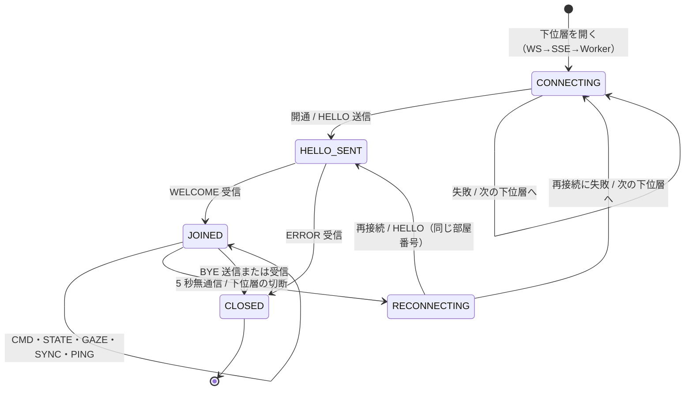
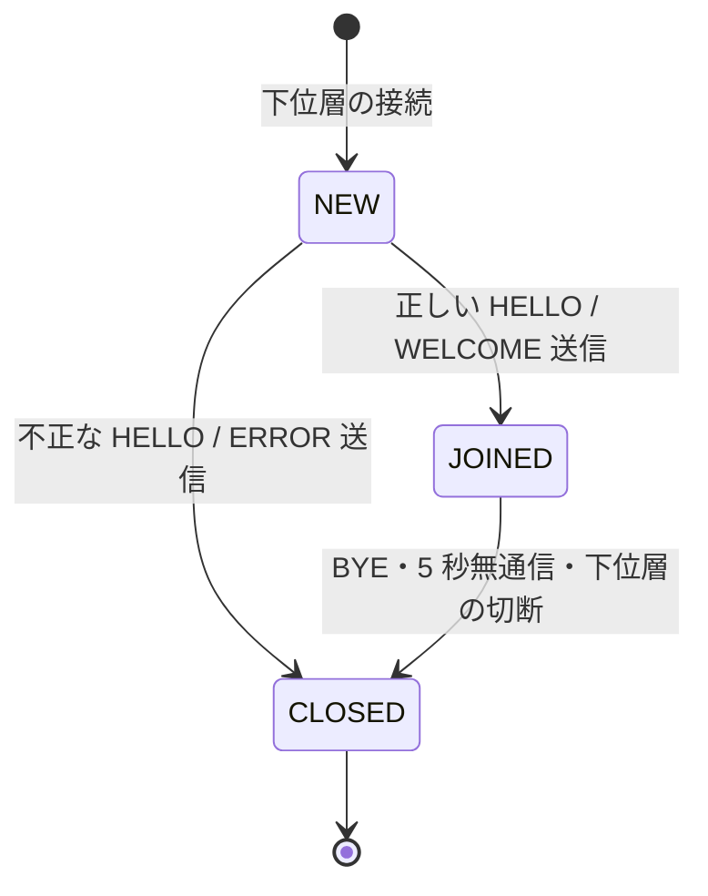
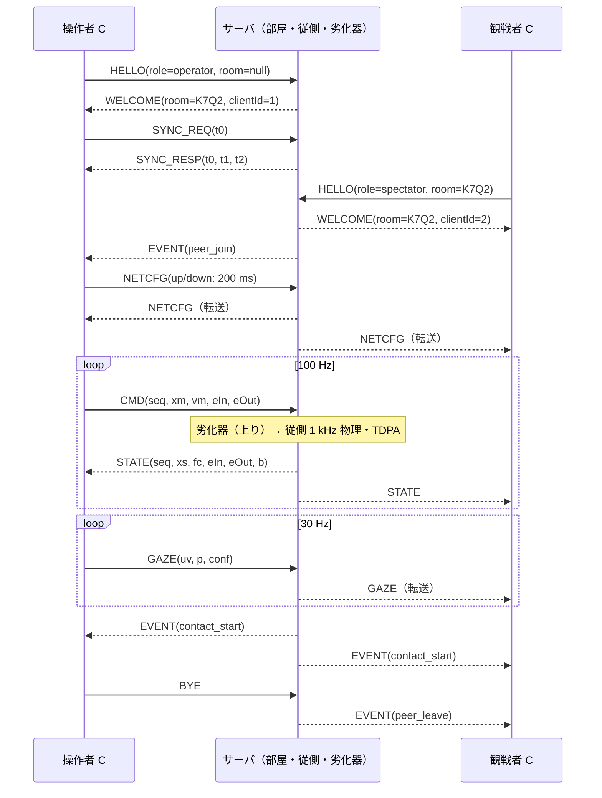

# GLP/1 — GazeLink 遠隔操作プロトコル 仕様書

GazeLink の操作者・観戦者（クライアント）と遠隔側ロボットを動かすサーバとの間で使う、アプリケーション層のプロトコル。版番号は 1。

## 1. 目的と設計方針

- **高頻度の制御情報は最新値だけに意味がある。** `CMD`・`STATE`・`GAZE` は通し番号付きで送り、古いもの・重複したものは捨てる（再送しない）。
- **制御情報は固定長バイナリ**で送る（1 通 16〜192 バイト）。JSON に比べて小さく、復号が速く、16 進で観察できる。
- **それ以外（参加、設定、出来事）は JSON** で送る。人が読めて、項目を後から足しやすい。
- **時刻同期は NTP と同じ 4 時刻方式**で行う。片道遅延を推定するのに使う。
- **遅延のある通信路の受動性を保つ（TDPA）ため、送出エネルギーを載せる。** `CMD` と `STATE` には、送り手の端子で積算したエネルギーを載せる。受け手はそれを相手側から届いたエネルギーの上限として使う（`docs/CONTROL.md` 参照）。

## 2. 下位トランスポートに対する仮定

GLP/1 は「メッセージ単位で、届くなら壊れずに届く」下位層を仮定する。使う下位層は次の 3 つで、クライアントは上から順に試す。

| 下位層 | 上り（クライアント→サーバ） | 下り（サーバ→クライアント） | 順序 | 信頼性 |
|---|---|---|---|---|
| WebSocket (`/ws`) | バイナリ／テキストフレーム 1 枚 = 1 メッセージ | 同左 | 保たれる | 保たれる（TCP） |
| SSE + HTTP POST | `POST /api/sse/send`：まとめ送り（下記） | `GET /api/sse`：イベント 1 件 = 1 メッセージ | 保たれる（POST は同時に 1 本だけ） | 保たれる（TCP） |
| Web Worker（一人用モード） | `postMessage` | `postMessage` | 保たれる | 保たれる |

- どの下位層も順序と信頼性を保つ。損失・順序の入れ替わり・揺らぎは、**サーバ内の「劣化器」（§6）が人工的に作り出す**。そのため、プロトコルは実ネットワークでそれらが起きた場合と同じ処理をする。
- **SSE での符号化：** イベントの `data:` 行に、バイナリなら `b:` の後に base64、JSON なら `j:` の後に JSON 本文を書く。
- **POST でのまとめ送り：** クライアントは送るメッセージを `COMM.sseBatchMs`（40 ms）ごとにまとめ、上と同じ形式の文字列の配列（JSON）として 1 回の POST で送る。
  - まとめても、各メッセージの通し番号と送信時刻は元のまま残る。
  - 受信側の処理は WebSocket のときと変わらない。
  - 上り `CMD` の到着間隔が 40 ms 周期で揃うことは、プロトコル観察画面で見える。

## 3. 共通の約束

- **時刻：** 各端末の単調増加するミリ秒時計（`performance.timeOrigin + performance.now()`、倍精度浮動小数点）を使う。以後、サーバの時計を S、クライアントの時計を C と書く。
- **エンディアン：** バイナリはすべてリトルエンディアン。
- **通し番号：** 送り手ごと・メッセージ種類ごとに独立した 32 ビットの番号で、1 から始まり 1 ずつ増える。
- **バイナリの共通ヘッダ（16 バイト）：**

| オフセット | 型 | 名前 | 内容 |
|---|---|---|---|
| 0 | u8 | `type` | 種類コード（§4） |
| 1 | u8 | `ver` | 版番号 = 1 |
| 2 | u16 | `flags` | `CMD`・`STATE` では試行番号（epoch）、他は 0 |
| 4 | u32 | `seq` | 通し番号 |
| 8 | f64 | `ts` | 送信時刻（送り手の時計、ms） |

- **JSON の共通項目：** `{"t": "<種類名>", "seq": <通し番号>, "ts": <送信時刻>, ...}`

## 4. メッセージ一覧

| コード | 種類 | 符号化 | 向き | 損失の対象 | 概要 |
|---|---|---|---|---|---|
| 0x01 | `HELLO` | JSON | C→S | × | 参加要求（役割、部屋番号） |
| 0x02 | `WELCOME` | JSON | S→C | × | 参加の受理。部屋番号・参加者番号・サーバ設定 |
| 0x03 | `SYNC_REQ` | バイナリ 16 B | C→S | ○ | 時刻同期の要求（t0） |
| 0x04 | `SYNC_RESP` | バイナリ 32 B | S→C | ○ | 時刻同期の応答（t0, t1, t2） |
| 0x10 | `CMD` | バイナリ 88 B | 操作者→S | ○ | 主側の位置・速度・波変数・送出エネルギー |
| 0x11 | `STATE` | バイナリ 192 B | S→全員 | ○ | 従側の状態・送出エネルギー |
| 0x12 | `GAZE` | バイナリ 42 B | 操作者→S→観戦者 | ○ | 視線点と信頼度 |
| 0x20 | `NETCFG` | JSON | 操作者→S→全員 | × | 劣化器の設定 |
| 0x21 | `CTRLCFG` | JSON | 操作者→S→全員 | × | 受動性制御の方式、視線適応の設定 |
| 0x22 | `RESET` | JSON | 操作者→S | × | 試行のやり直し（従側を初期姿勢へ戻す） |
| 0x30 | `EVENT` | JSON | S→全員 | × | 接触、通過点、到達、発振検出、参加者の出入り |
| 0x31 | `STATS` | JSON | S→各自 | × | サーバが観測した上り方向の計測値（1 Hz） |
| 0x40 | `PING` | バイナリ 16 B | 双方向 | ○ | 生存確認 |
| 0x41 | `PONG` | バイナリ 28 B | 双方向 | ○ | 生存確認の応答 |
| 0x7E | `ERROR` | JSON | S→C | × | 要求の拒否（部屋がない等） |
| 0x7F | `BYE` | JSON | 双方向 | × | 退出 |

- 「損失の対象」が × の種類は、劣化器が**遅延だけ**をかけ、捨てない。参加や設定が失われると、画面の表示と実際の状態が食い違うためである。
- 指示書の必須一覧に加えた種類は次の 4 つ。
  - `RESET`：試行ごとの初期化に使う。
  - `STATS`：上り方向の観測値を操作者に見せるのに使う。
  - `ERROR`：失敗理由を伝えるのに使う。
  - `SYNC_RESP` と `PONG`：応答の種類として独立させた。

### 4.1 `HELLO`（C→S, JSON）

```json
{"t":"HELLO","seq":1,"ts":1234.5,"role":"operator","room":null,"transport":"ws","proto":1}
```

- `role`：`"operator"` または `"spectator"`。
- `room`：部屋番号の文字列。操作者が `null` を送ると、新しい部屋を作る。操作者が既存の部屋番号を送ると、その部屋の操作者として戻る（切断後の再参加）。
- **受信時の動作（S）：**
  1. 役割と部屋を検証する。
  2. 通れば `WELCOME` を返す。通らなければ `ERROR` を返す（部屋がない、すでに操作者がいる、など）。
  3. 同じ部屋の他の参加者に `EVENT{kind:"peer_join"}` を送る。

### 4.2 `WELCOME`（S→C, JSON）

```json
{"t":"WELCOME","seq":1,"ts":98765.4,"room":"K7Q2","clientId":3,"role":"operator",
 "server":{"dt":0.001,"controlRateHz":100,"gazeRateHz":30,"mode":"network"},
 "netcfg":{...},"ctrlcfg":{...},"peers":[{"clientId":1,"role":"operator"}]}
```

**受信時の動作（C）：**
1. 状態を `JOINED` にする。
2. 時刻同期（`SYNC_REQ`）と生存確認（`PING`）の定期送信を始める。
3. 操作者であれば `CMD` の 100 Hz 送信と `GAZE` の 30 Hz 送信を始める。

### 4.3 `SYNC_REQ` / `SYNC_RESP`（バイナリ）

| メッセージ | オフセット | 型 | 名前 | 内容 |
|---|---|---|---|---|
| `SYNC_REQ` | 8 | f64 | `ts` | t0：クライアントの送信時刻（C） |
| `SYNC_RESP` | 8 | f64 | `ts` | t2：サーバの返信時刻（S） |
| | 16 | f64 | `t0` | 要求に書かれていた t0 をそのまま返す |
| | 24 | f64 | `t1` | サーバの受信時刻（S） |

`SYNC_RESP` のヘッダの `seq` には、対応する `SYNC_REQ` の `seq` を入れる。

**計算：** クライアントは t3（受信時刻、C）を記録し、次の 2 つを求める。

- 時計のずれ（S − C）：θ = ((t1 − t0) + (t2 − t3)) / 2
- 往復遅延：δ = (t3 − t0) − (t2 − t1)

直近 `COMM.syncFilterSize`（8）個の標本のうち **δ が最小のもの**の θ を採用する（NTP の時計フィルタと同じ考え方）。往路と復路の遅延が等しいとき、θ の誤差はゼロになる。遅延が非対称なとき、誤差は最大で (往路 − 復路)/2 になる。

### 4.4 `CMD`（操作者→S, バイナリ 88 B）

| オフセット | 型 | 名前 | 内容 |
|---|---|---|---|
| 16 | f32×3 | `xm` | 主側仮想質量の位置 [m]（ロボット基準座標） |
| 28 | f32×3 | `vm` | 主側の速度 [m/s] |
| 40 | f64 | `eIn` | 主側端子で通信路へ**入った**エネルギーの積算値 [J]（TDPA） |
| 48 | f64 | `eOut` | 主側端子で通信路から**出た**エネルギーの積算値 [J] |
| 56 | f64 | `offset` | 送り手が推定した時計のずれ θ（S − C）[ms] |
| 64 | f32×3 | `xh` | 手（マウス）の位置 [m] |
| 76 | f32×3 | `um` | 波変数 u_m（波変数方式のときだけ意味を持つ） |

**受信時の動作（S）：**
1. `seq` がこれまでの最大値以下なら捨てる。その数は「遅着」または「重複」として数える。
2. そうでなければ、従側の指令値を最新の値に置き換える。
3. 上りの片道遅延を `t_recv − (ts + offset)` で推定し、記録する。

### 4.5 `STATE`（S→全員, バイナリ 192 B）

| オフセット | 型 | 名前 | 内容 |
|---|---|---|---|
| 16 | f64 | `simTime` | サーバの物理時刻 [s] |
| 24 | f32×3 | `xs` | 従側先端の位置 |
| 36 | f32×3 | `vs` | 従側先端の速度 |
| 48 | f32×3 | `fe` | 環境からの接触力 [N] |
| 60 | f32×3 | `fc` | 通信路へ返す力（主側に加わる力の元）[N] |
| 72 | f32×3 | `xd` | 従側が今使っている指令位置（観戦者用のゴースト） |
| 84 | f32×7 | `q` | 関節角 [rad] |
| 112 | f32 | `b` | 視線適応ダンピング係数 b(t) [N s/m] |
| 116 | f32 | `pcPower` | 受動性制御器がいま消費している電力 [W] |
| 120 | f64 | `eIn` | 従側端子で通信路へ**入った**エネルギーの積算値 [J] |
| 128 | f64 | `eOut` | 従側端子で通信路から**出た**エネルギーの積算値 [J] |
| 136 | f64 | `eDiss` | 受動性制御器が消したエネルギーの積算値 [J] |
| 144 | f64 | `eGen` | 通信路が生み出したエネルギー E_gen [J]（`docs/CONTROL.md` §3） |
| 152 | u32 | `cmdSeq` | 最後に反映した `CMD` の通し番号 |
| 156 | f64 | `cmdRecv` | その `CMD` のサーバでの受信時刻（S） |
| 164 | u8 | `mode` | 0 = なし、1 = TDPA、2 = 波変数 |
| 165 | u8 | `contact` | 接触ビット（1 = 壁、2 = 床、4 = 目標） |
| 166 | f32 | `attention` | 先端位置での注意の強さ（0〜1） |
| 170 | f32 | `obstacle` | 最寄りの障害物（壁）までの距離 [m] |
| 174 | f32×3 | `us` | 波変数 v_s（従側から主側へ戻る波） |
| 186 | f32 | `hs` | 従側の蓄積エネルギー H_s [J] |
| 190 | u16 | `status` | ビット 0 = 関節可動域に到達、ビット 1 = 発振を検出、ビット 2 = 視線の信頼度が低い |

**受信時の動作（C）：**
1. 古い・重複したものは捨てる。
2. 最新の従側状態として描画に使う。操作者の場合は、`fc`・`eIn`・`eOut` を主側の制御に渡す。
3. 下りの片道遅延を `(t_recv + θ) − ts` で推定する。
4. `cmdSeq` と `cmdRecv` を、予測表示とシーケンス図に使う。

### 4.6 `GAZE`（操作者→S→観戦者, バイナリ 42 B）

| オフセット | 型 | 名前 | 内容 |
|---|---|---|---|
| 16 | f32×2 | `uv` | 画面上の視線点（0〜1 に正規化） |
| 24 | f32×3 | `p` | 視線の光線と作業空間の交点 [m] |
| 36 | f32 | `conf` | 推定の信頼度（0〜1） |
| 40 | u8 | `hit` | 交わった物：0 = なし、1 = 床、2 = 壁、3 = 目標、4 = 通過点 |
| 41 | u8 | `src` | 視線の出どころ：0 = カメラ、1 = マウス代用 |

**受信時の動作（S）：**
1. 古いものは捨てる。
2. 注意の場（`core/gaze/`）に標本として加える。
3. 観戦者それぞれに、下りの劣化器を通して転送する。このとき送信時刻と通し番号はサーバのものに付け替える。

### 4.7 `NETCFG`（JSON）

```json
{"t":"NETCFG","seq":4,"ts":...,"up":{"delayMs":200,"jitterMs":20,"allowReorder":false,"loss":0.05,"burst":true,"burstLength":4},
 "down":{...},"seed":12345}
```

- `up` と `down` は、それぞれの向きの片道の設定である。
- S は受け取った設定をすぐ劣化器に反映し、同じ内容を全員へ転送する。観戦者から送られた `NETCFG` は `ERROR{code:"forbidden"}` を返して拒否する。

### 4.8 `CTRLCFG`（JSON）

```json
{"t":"CTRLCFG","seq":5,"ts":...,"mode":"tdpa","waveImpedance":40,
 "gaze":{"enabled":true,"target":"master","forgetTau":2.0,"bMin":2,"bMax":60,"slewRate":150,"sigma":0.08}}
```

`gaze.target` は、視線適応ダンパをかける場所である。`"master"`（主側、標準）か `"slave"`（従側）を指定する（`docs/CONTROL.md` §5.5）。

- **受信時の動作（S）：**
  1. 方式を切り替え、**b(t) のスルーレート制限の内部状態を B_MIN に戻す**（`docs/CONTROL.md` §5.4）。
  2. 全員へ転送する。
  3. 方式が変わった場合は、**epoch を 1 増やし**、`EVENT{kind:"reset", data:{epoch, rebase:true}}` を全員へ送る。
     - 両端は受動性観測器のエネルギー積算を 0 から数え直す。アームの位置はそのまま。
     - 前の方式で通信路が生んだエネルギーが、新しい方式の観測器に持ち込まれないようにするためである（`docs/CONTROL.md` §4.2）。
- **受信時の動作（主側 C）：** 転送されてきた方式に主側の制御器を合わせる。

### 4.9 `RESET`（操作者→S, JSON）

```json
{"t":"RESET","seq":6,"ts":...}
```

- S は従側を初期姿勢に戻し、エネルギーの積算値・通過点・発振検出・b(t) の内部状態を初期化する。
- S は**試行番号（epoch）を 1 増やし**、`EVENT{kind:"reset", data:{epoch}}` を全員へ送る。
- 操作者はこれを受けて主側を初期化し、以後の `CMD` のヘッダ `flags` に新しい epoch を入れる。
- S は epoch の違う `CMD` を捨て、クライアントは epoch の違う `STATE` を捨てる。これで、初期化の前に送られた古いエネルギーの積算値が、初期化の後の受動性観測器に混ざることを防ぐ。

### 4.10 `EVENT`（S→全員, JSON）

```json
{"t":"EVENT","seq":17,"ts":...,"kind":"contact_start","data":{"surface":"wall","force":12.3}}
```

`kind` の種類：

| `kind` | 起きること |
|---|---|
| `contact_start` / `contact_end` | 接触の開始・終了 |
| `ring` | 通過点を通過（`data.id`） |
| `target` | 目標に到達 |
| `oscillation` | 発振を検出（`data.freqHz`、`data.amp`） |
| `peer_join` / `peer_leave` | 参加者の出入り |
| `reset` | 試行のやり直し |
| `operator_lost` | 操作者の切断 |

### 4.11 `STATS`（S→各自, JSON, 1 Hz）

サーバがその参加者からの上り方向について観測した値を返す。

- 種類ごとの受信数、損失数、遅着数、重複数、受信頻度 [Hz]
- RFC 3550 の到着間隔揺らぎ [ms]
- 片道遅延のヒストグラム（10 ms 刻み）
- 劣化器が実際にかけた遅延のヒストグラム
- 劣化器が実際に落とした数と、連続損失の長さの分布
- サーバの物理の刻みの実測周期と揺らぎ

### 4.12 `PING` / `PONG`（バイナリ）

- `PING` はヘッダだけ（16 B）。
- `PONG` の構成：

| オフセット | 型 | 名前 | 内容 |
|---|---|---|---|
| 8 | f64 | `ts` | 返信時刻 |
| 16 | u32 | `echoSeq` | 対応する `PING` の `seq` |
| 20 | f64 | `echoTs` | 対応する `PING` の送信時刻 |

- 受け手は必ず `PONG` を返す。`PING` の送り手は `now − echoTs` を RTT として記録する（同じ時計どうしの差なので、時刻同期は要らない）。
- どちらの側も、`COMM.pingTimeoutMs`（5 秒）の間、相手から何も届かなければ切断とみなす。

### 4.13 `ERROR` / `BYE`（JSON）

```json
{"t":"ERROR","seq":2,"ts":...,"code":"no_such_room","message":"部屋 K7Q2 は存在しません"}
{"t":"BYE","seq":9,"ts":...,"reason":"user"}
```

- `ERROR` の `code`：`no_such_room`、`operator_exists`、`forbidden`、`bad_message`、`version`。
- `BYE` を受けた側は、下位の接続を閉じる。サーバは他の参加者に `EVENT{kind:"peer_leave"}` を送る。

## 5. 状態遷移

### 5.1 クライアント



### 5.2 サーバ（参加者 1 人ぶん）



### 5.3 部屋

- 操作者の `HELLO(room=null)` で部屋が作られる。部屋番号は、見間違えやすい文字（0, O, 1, I）を除いた英大文字と数字の 4 文字。
- 操作者が切断すると、部屋は 60 秒間保持される。その間、従側は最後の指令位置で待機する。
- 60 秒のうちに操作者が同じ部屋番号で戻れば、操作を再開できる。
- 誰もいなくなってから 60 秒たつと、部屋は消える。

## 6. 劣化器（サーバ内）

- 劣化器は**向き（上り／下り）× 参加者 × メッセージ種類**ごとに独立に置く。それぞれが次の 3 つを独立に持つ。
  - 乱数の系列
  - Gilbert–Elliott モデルの状態
  - FIFO の最終配送時刻
- **遅延：** `delay = max(0, delayMs + jitterMs · N(0,1))`
- **順序：** `allowReorder = false` のとき、配送時刻を `max(delay 後の時刻, 同じ流れの直前の配送時刻)` とする。揺らぎがあっても順序は入れ替わらない（その分、遅延の分布は右に寄る）。
- **損失：** `burst = false` なら、各メッセージを確率 `loss` で捨てる。`burst = true` なら、Gilbert–Elliott の二状態マルコフ連鎖を使う。
  - 良い状態では損失 0、悪い状態では損失 1 とする。
  - 遷移確率は p_GB = loss · p_BG / (1 − loss)、p_BG = 1 / burstLength とする。
  - これで長期の損失率が `loss`、連続損失の平均長が `burstLength` になる。
- 捨てられたメッセージと実際にかけた遅延は、劣化器が記録する。その値は `STATS` とプロトコル観察画面のヒストグラムに出る。

## 7. 計測（受信側）

受け手は、送り手 × 種類ごとに次を記録する。

| 項目 | 求め方 |
|---|---|
| 損失率 | `1 − 受信数 / (最大 seq − 最初の seq + 1)`（直近 1 秒の窓と通算） |
| 順序の入れ替わり | `seq` がそれまでの最大値より小さい |
| 重複 | 直近 64 個のビット表で同じ `seq` を検出 |
| 到着間隔揺らぎ（RFC 3550 §6.4.1） | D = (R_i − R_{i−1}) − (S_i − S_{i−1})、J ← J + (\|D\| − J)/16 |
| 片道遅延 | 時刻同期のずれ θ で補正した `受信時刻 − 送信時刻` |
| RTT | `SYNC` の δ と `PING`/`PONG` の往復時間の両方 |

すべての送受信（時刻、向き、種類、seq、大きさ、符号化方式、片道遅延）は、クライアントの記録に残る。記録は JSON Lines と CSV でダウンロードできる。

## 8. 正常時の流れ



## 9. 版の扱い

- `HELLO` の `proto` がサーバと合わなければ、`ERROR{code:"version"}` を返す。
- バイナリのヘッダの `ver` が合わないメッセージは捨て、`bad_message` として数える。
